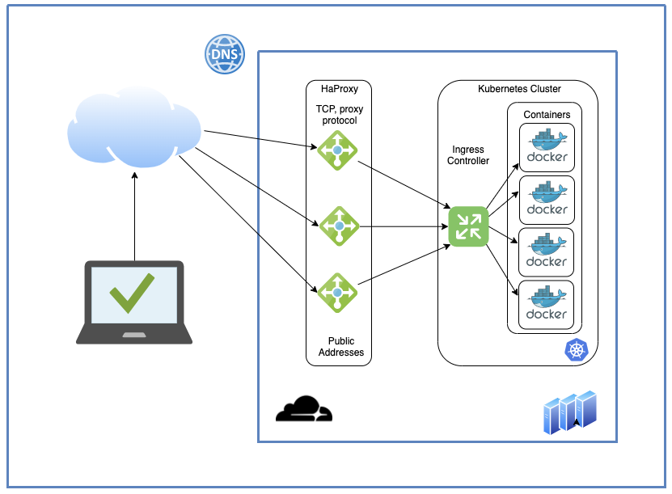

  [Home](https://crwlabs.github.io/hands-on-devops/) | [Dia 01](https://crwlabs.github.io/hands-on-devops/dia-01) | [Dia 02](https://crwlabs.github.io/hands-on-devops/dia-02) | [Dia 03](https://crwlabs.github.io/hands-on-devops/dia-03) | [Dia 04](https://crwlabs.github.io/hands-on-devops/dia-04)

## Bem Vindo ao Projeto Hands On DevOps Online

O projeto foi idealizado com o intuito de aprender fazendo hands-on na criação de um ambiente do zero. Na solução proposta no diagrama, vamos configurar um cluster kubernetes com um controlador de ingress e as seguintes ferramentas:

- Nginx-ingress ou Istio
- Helm3
- Ferramenta CI/CD - Drone CI/Jenkins
- NFS para provisionar volumes
- Cert-manager para emitir certificados Letsencrypt
- Cloudflare para a configuração de DNS

**Diagrama**

**Cronograma**

| Data | Assunto | Dia	| Detalhes | Participantes
| :---: | :---: | :---: | :---: | :---: |
| 15/04/2020 | Setup Inicial do Ambiente | 01 | kubernetes, helm3  | Wilton, Carlos, Rafael
| XX/04/2020 | Volumes e Pipeline Ci/Cd | 02 | A definir | A definir
| XX/04/2020 | A definir | 03 | A definir | A definir.

**Objetivo?**
- Abordar os conceitos de DevOps e utilizando os principais de infraestrutura e realizar laboratórios práticos.

**Antes de Começar**
- **Infraestrutura**: Estamos utilizando um servidor CentOS 7 na Infra do LinuxAcademy. Você pode conferir no passo a passo da documentação do Dia 01!
- **Volumes**: Para infraestrutura de cloud, o ideia seria utilizar volumes de discos como persistent storage ou PV. Porém nos laboratorios faremos uso de NFS para provisionar os volumes!
- **Arquivos Utilizados**: Todos os arquivos utilizados estão neste repositório.

**Participantes**
- Wilton Paulo, Carlos Castro e Rafael Moreira

**Canal do Slack**
[crwlabs.slack.com](https://crwlabs.slack.com)
