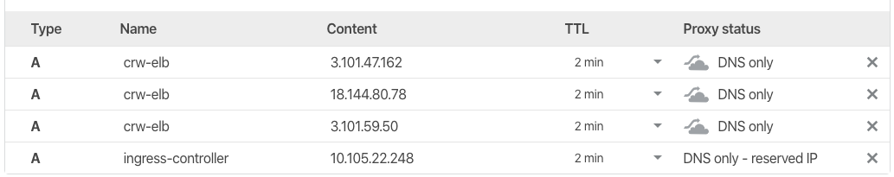

  [Home](https://crwlabs.github.io/hands-on-devops/) | [Dia 02](https://crwlabs.github.io/hands-on-devops/dia-02)

## Dia 02

## Volumes e Pipeline


### Configurar NFS Server no Master
**Instalar e Iniciar o NFS Server**

```
yum install -y nfs-utils
systemctl start nfs-server rpcbind
systemctl enable nfs-server rpcbind
```

**Criar diretório e dar permissão**

```
mkdir /data
chmod 777 /data
```

**Editar o /etc/exports e liberar o acesso as instancias do cluster**

```
vi /etc/exports
/data master-node(rw,sync,no_root_squash)
/data worker-node1(rw,sync,no_root_squash)
/data worker-node2(rw,sync,no_root_squash)
```

**Ativar a configuração e validar**
```
exportfs -r
showmount -e master-node
```

### Configurar HaProxy nas 3 instâncias

**Instalar o pacote haproxy**
```
yum -y install haproxy
```

**Incluir a configuração no haproxy**
```
vi /etc/haproxy/haproxy.cfg
```

<details>
<summary>Ver configuração</summary>

```
global
	log /dev/log	local0
	log /dev/log	local1 notice
	chroot /var/lib/haproxy
	stats socket /run/haproxy/admin.sock mode 660 level admin expose-fd listeners
	stats timeout 30s
	user haproxy
	group haproxy
	daemon

	# Default SSL material locations
	ca-base /etc/ssl/certs
	crt-base /etc/ssl/private

	# Default ciphers to use on SSL-enabled listening sockets.
	# For more information, see ciphers(1SSL). This list is from:
	#  https://hynek.me/articles/hardening-your-web-servers-ssl-ciphers/
	# An alternative list with additional directives can be obtained from
	#  https://mozilla.github.io/server-side-tls/ssl-config-generator/?server=haproxy
	ssl-default-bind-ciphers ECDH+AESGCM:DH+AESGCM:ECDH+AES256:DH+AES256:ECDH+AES128:DH+AES:RSA+AESGCM:RSA+AES:!aNULL:!MD5:!DSS
	ssl-default-bind-options no-sslv3

defaults
	log	global
	mode	http
	option	httplog
	option	dontlognull
        timeout connect 5000
        timeout client  50000
        timeout server  50000
	errorfile 400 /etc/haproxy/errors/400.http
	errorfile 403 /etc/haproxy/errors/403.http
	errorfile 408 /etc/haproxy/errors/408.http
	errorfile 500 /etc/haproxy/errors/500.http
	errorfile 502 /etc/haproxy/errors/502.http
	errorfile 503 /etc/haproxy/errors/503.http
	errorfile 504 /etc/haproxy/errors/504.http

frontend kube-ssl
  bind *:443
  mode tcp
  option tcplog
  timeout client 1m
  default_backend ssl-backend

frontend kube-http
  bind *:80
  mode tcp
  option tcplog
  timeout client 1m
  default_backend http-backend

backend ssl-backend
  mode tcp
  option tcplog
  option log-health-checks
  option redispatch
  log global
  balance roundrobin
  timeout connect 10s
  timeout server 1m
  server nginx ingress-controller.tecdump.com:443 check

backend http-backend
  mode tcp
  option tcplog
  option log-health-checks
  option redispatch
  log global
  balance roundrobin
  timeout connect 10s
  timeout server 1m
  server nginx ingress-controller.tecdump.com:80 check
```

</details>

**Ativar e iniciar o serviço**
```
systemctl enable haproxy
systemctl start haproxy
```

### Apontar o DNS para o Ingress-Controller e Instancias com HaProxy
**Identificar o clusterID do Ingress-controller**

```
kubectl get svc -n nginx-ingress | grep ClusterIP
```

**Acessar o cloudflare e criar um apontamento de DNS Para o IngressController (interno)**
>ingress-controller.\<dominio\>.com IN A \<IP do ingress-controller\>

**Acessar o cloudflare e criar um apontamento de DNS Para o Haproxy (externo)**

```
crw-elb.\<dominio\>.com IN A \<IP público do master-node\>
crw-elb.\<dominio\>.com IN A \<IP público do worker-node1\>
crw-elb.\<dominio\>.com IN A \<IP público do worker-node2\>
```



**Teste se o DNS foi atualizado**
>ping ingress-controller.\<dominio\>.com
>ping crw-elb.\<dominio\>.com

### Instalar Drone-Ci
**Criar diretório para incluir arquivos do Drone**

```
$ mkdir apps/drone
$ cd apps/drone
$ kubectl create ns drone
```

**Criar o volume para o Drone Ci**

<details>
<summary>apps/drone/volume.yaml</summary>

```
apiVersion: v1
kind: PersistentVolume
metadata:
  name: data-drone
  namespace: drone
  labels:
    app: drone
spec:
  capacity:
    storage: 1Gi
  accessModes:
    - ReadWriteMany
  nfs:
    server: master-node
    path: /data/drone
---
apiVersion: v1
kind: PersistentVolumeClaim
metadata:
  name: data-drone
spec:
  accessModes:
    - ReadWriteMany
  resources:
    requests:
      storage: 1Gi
```

</details>

**Aplicar a configuração e validar**

```bash
$ kubectl apply -f volume.yaml
$ kubectl get pvc -n drone
NAME         STATUS   VOLUME       CAPACITY   ACCESS MODES   STORAGECLASS   AGE
data-drone   Bound    data-drone   1Gi        RWX                           1m
```

**Acessar a conta do Github, criar um secret token para o acesso do Drone e executar...**
Acessar em Settings >> Developer settings >> em Oauth Applications >> Register a new applications

```
$ kubectl create secret generic drone-server-secrets --namespace=drone --from-literal=clientSecret="token gerado"
```

**Instalar o Helm do Drone**


apps/drone/values.yaml
```
env:
  DRONE_SERVER_HOST: drone-crwlabs.tecdump.com
  DRONE_SERVER_PROTO: https
  DRONE_RPC_SECRET: randomly-generated-secret-here
  DRONE_GITHUB_CLIENT_ID: xxxxxxxxxxxxxxxxxxxxxxx
  DRONE_GITHUB_CLIENT_SECRET: yyyyyyyyyyyyyyyyyyyyy
```


```
https://github.com/drone/charts/tree/master/charts/drone

export DRONE_GITHUB_CLIENT_ID: xxxxxxxxxxxxxxxxxxxxxxx
export DRONE_GITHUB_CLIENT_SECRET: yyyyyyyyyyyyyyyyyyyyy

helm repo add drone https://charts.drone.io
helm repo update
helm install --namespace drone drone drone/drone

$ helm install --name drone --namespace drone stable/drone
$ helm upgrade drone \
      --reuse-values \
      --set 'sourceControl.provider=github' \
      --set 'sourceControl.github.clientID=id do client github' \
      --set 'sourceControl.secret=drone-server-secrets' \
      --set 'server.host=drone.tecdump.com' \
      --set 'service.type=ClusterIP' \
      --set 'persistence.existingClaim=data-drone' \
      --set 'server.logs.debug=true' \
      stable/drone
```

**Configurar ingress-gateway**

<details>
<summary>apps/drone/ingress.yaml</summary>

```
apiVersion: extensions/v1beta1
kind: Ingress
metadata:
  annotations:
    cert-manager.io/cluster-issuer: letsencrypt-cloudflare
    kubernetes.io/ingress.class: nginx
    kubernetes.io/tls-acme: "true"
  name: ingress-drone
  namespace: drone
spec:
  rules:
  - host: drone-crwlabs.tecdump.com
    http:
      paths:
      - backend:
          serviceName: drone-drone
          servicePort: 80
  tls:
  - hosts:
    - drone-crwlabs.tecdump.com
    secretName: tecdump-com-tls
```

</details>

**Aplicar configuração usando kubectl**

```
$ kubectl apply -f ingress.yaml
```

**Configurar o apontamento CNAME DNS no Cloudflare**

```
drone-crwlabs.tecdump.com IN CNAME elb-crwlabs.tecdump.com
```

## Criar imagem base para o Pipeline
## Fazer Pipeline de Aplicação de Backend
## Fazer Pipeline de Aplicação de FrontEnd
